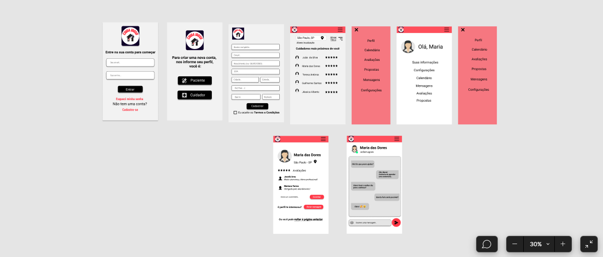

# CuidaIdoso

Uma aplicação que conecta pacientes a cuidadores e enfermeiros particulares
Web app utilizando Vue.js, realizado no projeto integrador do curso de Análise e Desenvolvimento de Sistemas (4° semestre)
**Última atualização do respositório: 06/05/2022**

**Protótipo: **
[Link do ](https://www.figma.com/community/file/1104383146968974844?preview=fullscreen)




## Project setup
```
npm install
```

### Compiles and hot-reloads for development
```
npm run serve
```

### Compiles and minifies for production
```
npm run build
```

### Lints and fixes files
```
npm run lint
```

### Customize configuration
See [Configuration Reference](https://cli.vuejs.org/config/).
